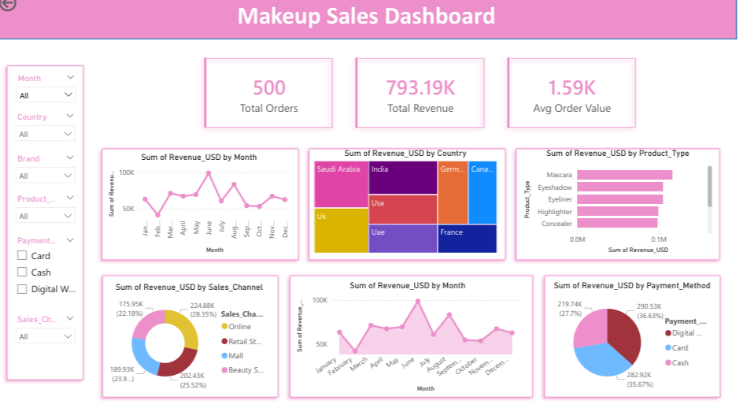

## Makeup Sales Analysis Dashboard

End-to-End Data Analytics Project | Python • SQL • Power BI

### Overview

This project presents a comprehensive end-to-end data analytics workflow applied to a makeup sales dataset. It demonstrates the ability to transform raw transactional data into structured insights and business intelligence using industry-standard tools.

The analysis focuses on identifying revenue drivers, product performance, regional trends, and customer behavior, culminating in an interactive dashboard designed for decision-making.

### Objectives

Analyze sales performance across products, brands, and regions
Identify key revenue contributors and growth patterns
Evaluate sales channels and payment behavior
Deliver actionable insights through a professional dashboard

### Tools & Technologies

Google Colab — Data preprocessing & analysis
Pandas — Data transformation
Matplotlib & Seaborn — Exploratory analysis
MySQL — Structured querying & aggregation
Power BI — Dashboard & visualization

### Data Preparation

The dataset was processed to ensure analytical reliability and consistency:

Standardized categorical fields (Brand, Product Type, Country, etc.)
Converted date fields into appropriate datetime format
Removed duplicate records
Validated revenue calculations (Price_USD × Units_Sold)
Exported a clean dataset for downstream analysis

### Exploratory Data Analysis

EDA was conducted to uncover patterns and relationships within the dataset:

Revenue trends across time (monthly analysis)
Product category and brand performance
Geographic distribution of sales
Sales channel comparison (online vs offline)

These analyses provided the foundation for deeper SQL-based insights.

### SQL Analysis

The cleaned dataset was loaded into MySQL to perform structured, business-oriented analysis.

### Key Queries Included:

Top-performing products by revenue
Monthly sales trends
Country-wise revenue distribution
Product category performance
Sales channel and payment method analysis
High-value transaction identification
Average order value calculation

This stage enabled scalable and efficient insight generation across multiple business dimensions.

### Dashboard

An interactive dashboard was developed using Power BI to present insights in a clear and accessible format.

### Key Features:

KPI Metrics: Total Revenue, Orders, Average Order Value
Trend Analysis: Monthly revenue performance
Comparative Insights: Product types, brands, and regions
Distribution Analysis: Sales channels and payment methods
Interactivity: Dynamic filtering using slicers

### Dashboard Preview

### Project Demonstration

(Insert video demo link here — Google Drive / YouTube / LinkedIn)

### Key Insights

A limited number of product categories contribute a majority of total revenue
Online sales channels consistently outperform offline channels
Revenue distribution is concentrated within specific geographic regions
Sales exhibit clear temporal patterns indicating seasonality
Brand-level concentration suggests opportunities for diversification

### Business Recommendations
Product Strategy: Prioritize high-performing product categories for inventory and promotion
Channel Optimization: Expand and optimize online sales channels to maximize revenue
Regional Focus: Invest in high-performing regions while improving underperforming markets
Customer Experience: Streamline payment methods to reduce friction and improve conversions
Seasonal Planning: Align marketing campaigns with peak sales periods
